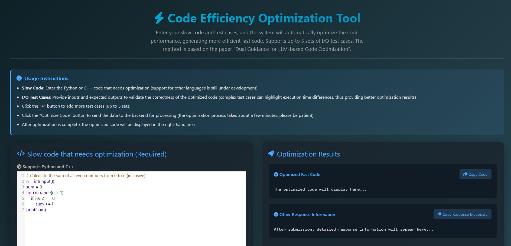
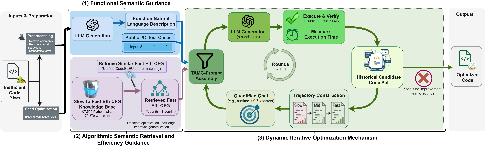

## Rebuttal Supplement: Effi-CFG Clarification

The rebuttal submission form did not render two mathematical expressions correctly. We therefore reproduce the corresponding Q3 response below, with the two expressions rendered as GitHub-supported mathematical notation; the remaining content is unchanged.

**Q3-Reviewers-B-C: What_is_Effi-CFG's_contribution_mechanism? How_can_Effi-CFG_support_the_claims_of_retrieval_reliability_and_generalizability_across_programs? What_happens_if_a_randomly_selected_Effi-CFG_is_supplied_instead_of_the_retrieved_one?**

**Answer:** The design motivation behind Effi-CFG is to provide compact control_structures and library_call cues, enabling the generative model to reference optimized structures (along with functional_descriptions, public tests, etc.) when performing refactoring. Effi-CFG preserves not only loop_types but also complete loop_headers and control-flow relationships, thereby capturing iteration_ranges, termination_conditions, explicit step_sizes, and the sequential and nested relationships between loops. For instance, assuming constant-time loop bodies, an outer loop executing n times with a nested inner_loop executing n or $\log n$ times provides clues to distinguish between quadratic and $n\log n$ complexities. This information, combined with preserved library_calls, offers structural guidance for optimization, though it does not guarantee a definitive determination or distinction of all algorithmic complexities. For graphs derived from different problems, the model utilizes these structural_clues alongside source_code, functional_descriptions, and sample I/O, with candidates subsequently undergoing execution-based verification. The graphs serve as structural references rather than ready-to-use solutions.

We clarify that during retrieval, CodeBLEU compares the normalized input "slow-code" with "slow-code" entries in the knowledge base, and retrieves the corresponding high-efficiency Effi-CFG for the matching entry. Note that the retrieval_score is not based on the graph. In the supplementary full-pipeline ablation using the Q6 settings, Top-5-SP was 349.90% for the full method, 332.90% without efficiency_guidance, 331.37% with a conventional CFG, and 336.65% with a randomly selected Effi-CFG, supporting the utility of both the representation and similarity-based selection in this setting.

---

# Dual Guidance for LLM-based Code Optimization


## 🚀 Try Our Online Demo!

Here is a snapshot of the web interface:




**Boost your code efficiency with GBLLM now!**

We have developed an online demo based on the method proposed in our paper **"Dual Guidance for LLM-based Code Optimization"**. You can directly experience the powerful code optimization capabilities of GBLLM without the need for local environment configuration.

👉 **[Click here to access the Code Efficiency Optimization Tool: http://www.codeoptimization.xyz](http://www.codeoptimization.xyz)**

* **✨ Key Features:**
    * **Auto-Optimization:** Simply input your slow code, and the system will automatically generate efficient **Fast Code**.
    * **Multi-language Support:** Full support for **Python** and **C++**.
    * **I/O Validation:** Supports custom input/output test cases to check observed behavior before accepting a faster candidate.


## Introduction




GBLLM is a guidance-based framework for high-level source code optimization. It addresses two practical challenges: reducing correctness regressions during generation and searching a large, sparsely rewarding optimization space. GBLLM uses semantic guidance and I/O execution checks to preserve observed behavior while pursuing measurable speedups; these checks provide empirical validation on the available tests, not a formal guarantee of functional equivalence.

At its core, GBLLM operationalizes dual guidance in functionality and efficiency through three components: Functional Semantic Guidance (natural-language functional summaries and I/O descriptions), Algorithmic Semantic Retrieval and Efficiency Guidance (using compact Effi-CFG representations as candidate structural guidance), and a Dynamic Iterative Optimization Mechanism that builds “slow–medium–fast” performance trajectories to set quantitative targets per iteration.


## Extended Ablation Results

We conducted an additional ablation study using **DeepSeek-V4.1-Flash** on the same 62 tasks sampled from PIE-Python with a step size of 10. All variants used the same initialization, maximum generation budget, stopping rule, and evaluation protocol, and ran for at most three iterations. The final OPT and SP values of every ablated variant are lower than those of the full method, providing complementary evidence for the role of each component in the complete pipeline. These findings are limited to this model and task subset.

CSV data: [DeepSeek-V4.1-Flash Ablation Results](https://drive.google.com/drive/folders/1yJV1ZeHO9pPOC4yLDoTFWYggZvz5naIN?usp=sharing)

| **Method** | **OPT Top-1** | **OPT Top-3** | **OPT Top-5** | **SP Top-1** | **SP Top-3** | **SP Top-5** |
|------------|--------------:|--------------:|--------------:|-------------:|-------------:|-------------:|
| Full GBLLM | 62.90 | 67.74 | 67.74 | 319.50 | 348.97 | 349.90 |
| w/o NL Guidance | 61.29 | 64.52 | 64.52 | 312.82 | 323.85 | 325.94 |
| w/o I/O Guidance | 58.06 | 62.90 | 62.90 | 306.39 | 321.10 | 321.44 |
| w/o Effi-CFG Guidance | 56.45 | 59.68 | 62.90 | 283.73 | 325.03 | 332.90 |
| Replace Effi-CFG with CFG | 58.06 | 61.29 | 62.90 | 294.87 | 311.24 | 331.37 |
| w/o Quantitative Target | 54.84 | 58.06 | 58.06 | 296.84 | 312.74 | 314.27 |
| w/o Trajectory Guidance | 59.68 | 62.90 | 62.90 | 313.53 | 326.73 | 328.44 |
| Random Effi-CFG | 56.45 | 62.90 | 64.52 | 309.60 | 331.66 | 336.65 |
| w/o All Components | 56.45 | 59.68 | 59.68 | 297.74 | 315.19 | 316.18 |


## Budget Fairness and Cost

We additionally compared COT, SBLLM, and GBLLM using **DeepSeek-V4.1-Flash** on the same 62 tasks sampled from PIE-Python with a step size of 10. All methods used the same public-test filtering, private-test evaluation, and Top-k calculation rules. The API-call counts include initialization and failed retries; the GBLLM count also includes functional-description generation.

| **Method** | **Average API Calls per Task** | **Estimated Input + Output Tokens per Task** |
|------------|-------------------------------:|---------------------------------------------:|
| COT | 21.00 | ~26K |
| SBLLM | 21.13 | ~52K |
| GBLLM | 19.55 | ~26K |

| **Method** | **OPT Top-1** | **OPT Top-3** | **OPT Top-5** | **SP Top-1** | **SP Top-3** | **SP Top-5** |
|------------|--------------:|--------------:|--------------:|-------------:|-------------:|-------------:|
| COT | 61.29 | 64.52 | 64.52 | 310.42 | 327.65 | 328.81 |
| SBLLM | 53.23 | 58.06 | 59.68 | 314.18 | 320.61 | 324.35 |
| GBLLM | 62.90 | 67.74 | 67.74 | 319.50 | 348.97 | 349.90 |

GBLLM achieves higher metrics than COT under a similar total token budget. Compared with SBLLM, GBLLM uses approximately half as many tokens while still achieving higher metrics. These results provide complementary evidence about GBLLM's cost-effectiveness and indicate that its advantage cannot be explained solely by a larger generation budget. The conclusion is limited to this task subset and to API-call and token costs; it does not cover end-to-end latency.

Full Top-k results, the sampled-task list, and measurement details are available in the [Budget Fairness and Cost CSV Data](https://drive.google.com/drive/folders/1hXiJwMy-e7ekrBIuzGUoH_lMUpm7Zbfy?usp=sharing).

The existing generation entry points used for this comparison are `baselines/SBLLM/Single-Round/cot.sh` (COT), `baselines/SBLLM/sbllm/run.sh` (SBLLM), and `GBLLM_RQ1/Generate_Code.sh` (GBLLM).


## Dependencies

Python 3.13.7

C++20

GCC 13.1.0

Linux

Run the following command in the root directory of this repository:

```sh
pip install -r requirements.txt
```

The legacy `requirement.txt` file is retained as a compatibility alias and includes `requirements.txt`.


## Replication Guide

The large knowledge bases and generated-result CSV files remain external because of their size. Download them from the links below, then pass their local paths explicitly to the analysis scripts with `--dataset-path`. Run `python <script> --help` to see every supported argument.

First, install the required dependencies as described above.


This section provides instructions for reproducing the experimental results presented in the paper, with the following research questions (RQ):

 - `RQ1`: How effective is GBLLM in enhancing code efficiency?

 - `RQ2`: What are the fine-grained performance characteristics of the code generated by GBLLM at various optimization levels?

 - `RQ3`: How do individual components of GBLLM contribute to the overall performance?

 - `RQ4`: Can GBLLM perform effective optimization on code from real-world open-source projects without relying on specific project history data and knowledge bases?


### Comparison of GBLLM and Baselines (RQ1)


Baselines: The source code of other baseline methods is in the `baselines/` folder. Detailed instructions on how to use them can be found in the `README.md` file within the `baselines/` folder.


GBLLM: Steps to reproduce the results. To reproduce the experimental results, follow these steps:
1) Data Access: Download the necessary datasets for using GBLLM, specifically the Slow-to-Fast Effi-CFG Knowledge Base and PIE_processed_data.
2) Running GBLLM and Obtaining Results: Use GBLLM to generate code data on five different LLMs (Large Language Models). The generated results can be found in the Results Generated by GBLLM section.
3) Generate Code Evaluation Results Using Metrics (OPT and SP): Analyze the code generated by GBLLM to obtain the OPT (Optimization) and SP (Speed) metrics.


#### 1. Data Access

We use the following scripts to process the data, which are described as follows:

 - `API__code_sanitization.py`: This script is used for dataset and code preprocessing, which is performed at two levels: simple sanitization and complex sanitization. The dataset undergoes complex sanitization, while GBLLM uses simple sanitization.

 - `API__Remove_Inline_Breaks.py`: This script addresses line-breaking issues caused by the Abstract Syntax Tree (AST) sanitization, which results in excessively long lines of code.

 - `API__unify_variable_name_function.py`: This script standardizes the variable and function names across the code.


The download links for the datasets are provided below:

 - Download `*Datasets*`


|                | **Language** | **Datasets**   | **Slow-to-Fast Effi-CFG Knowledge Base**         |
|----------------|--------------|----------------|--------------------------------------------------|
| **PIE-C++**    | C++          | [PIE_Cpp.csv](PIE/PIE_Cpp.csv)    | [Cpp__Slow_to_Fast_Effi_CFG_Knowledge_Base.csv](https://drive.google.com/file/d/1-nBPvQ2Bw08fX2FOQPzTABbrK_QFho_T/view?usp=sharing)    |
| **PIE-Python** | Python       | [PIE_Py.csv](PIE/PIE_Py.csv) | [Python__Slow_to_Fast_Effi_CFG_Knowledge_Base.csv](https://drive.google.com/file/d/1-rGSrOy5phe5ffyPqK71gjxQZQlFp7Sp/view?usp=sharing) |
| **PPIE**       | Python       | [PPIE.csv](PPIE/PPIE.csv)      | [Python__Slow_to_Fast_Effi_CFG_Knowledge_Base.csv](https://drive.google.com/file/d/1-rGSrOy5phe5ffyPqK71gjxQZQlFp7Sp/view?usp=sharing) |


#### 2. Running GBLLM and Obtaining Results

In this section, you will generate results using GBLLM.

Our code relies on the service of OpenAI (for ChatGPT, GPT-4), Google (for Gemini), DeepSeek, and DeepInfra (for CodeLLaMa), so you need first obtain their API keys. After obtaining the API keys, execute the following command to generate code data from GBLLM across five different LLMs.

The model labels and core indices exposed by the artifact are listed at the top of `GBLLM_RQ1/Generate_Code.sh`; their runtime API identifiers are mapped in `GBLLM_RQ1/Large_model_API_generation.py`. Core index `519` passes the exact model string `DeepSeek-V3.2-Exp`, while core index `529` passes `deepseek-flash` for the supplementary DeepSeek-V4.1-Flash experiments. API credentials are intentionally not committed; add them to the provider-specific key lists in `GBLLM_RQ1/API__Single_Generation.py` before generation. The two GBLLM prompt templates used by RQ1 are:

- `GBLLM_RQ1/Prompt/5_Generate_NL_Use_IO__My_Adopted.py` for functional descriptions.
- `GBLLM_RQ1/Prompt/14_Generate_Code_COT_CFG_Use_NL_Use_IO_Use_Slow_Mid_Fast_Time__My_Adopted.py` for iterative optimization.

```bash
cd GBLLM_RQ1
bash Generate_Code.sh
```

Description of the Python scripts used in `Generate_Code.sh`:

 - `API__Single_Generation.py`:  A wrapper for generating code using LLMs, which includes five different LLMs.

 - `Large_model_API_generation.py`: A Python script for generating code functionality descriptions and optimized fast code using GBLLM.


Results Generated by GBLLM: The following are the results generated by GBLLM on five different LLMs. These include both the generated descriptions of slow code functionalities and the optimized fast code. For each case, GBLLM performs up to three generation rounds. In each round, the functionality description contains a single entry, and five versions of the fast code are generated.


|                | **Language** | **GBLLM Generated Code (Includes CodeLlama-13b-Instruct-hf, CodeLlama-34b-Instruct-hf, Gemini-2.5-flash, GPT-3.5-turbo-0125 and DeepSeek-V3.2-Exp)** |
|:--------------:|:------------:|:-----------------------------------------------------------------------:|
| **PIE-C++**    | C++          | [PIE C++ Generated Code](https://drive.google.com/drive/folders/1Byz2aDAo7UUqPN4OYY9ojhOpZluo_Ura?usp=sharing)                                                  |
| **PIE-Python** | Python       | [PIE Python Generated Code](https://drive.google.com/drive/folders/1-uupbm_tASMjDDxPMEYAjLr6enomOFMT?usp=sharing)                                               |
| **PPIE**       | Python       | [PPIE Python Generated Code](https://drive.google.com/drive/folders/14SlyX-pNig4J1gaoFn7CJetOHv4fmLvU?usp=sharing)                                              |


#### 3. Generate Code Evaluation Results Using Metrics (OPT and SP)

You can use the following script to calculate and report the OPT and SP metrics for the files generated by GBLLM:

```bash
cd GBLLM_RQ1
python Statistical_Generation_Code_Data_RQ1.py \
  --dataset-path "/absolute/path/to/downloaded_rq1_results.csv" \
  --column-prefix "Cot_NL_CFG_SlowMidFastTime_Round3_G5" \
  --mode 0 \
  --output-path "rq1_metrics.txt" \
  --rq2-histogram-output "rq2_histogram.csv" \
  --rq2-venn-output "rq2_venn.csv" \
  --rq2-dataset-label "PIE_Py" \
  --rq2-method-label "GBLLM" \
  --case-id-column "submission_id_v0"
```

`--column-prefix` selects the method and iteration encoded in the downloaded CSV. Inspect the CSV headers and change the example prefix when evaluating a different method or round. The five `--rq2-*`/`--case-id-column` arguments are optional; when supplied, the script upserts the selected dataset-method row in the histogram CSV and the faster-than-human case IDs in the Venn CSV.

`Statistical_Generation_Code_Data_RQ1.py`:  A script for calculating and reporting the OPT and SP metrics for the files generated by GBLLM.


### Fine-Grained Analysis of GBLLM (RQ2)

Using the code data generated in RQ1, you can use the following script to generate the bar charts for RQ2, as presented in the paper:

```bash
cd GBLLM_RQ2_Drafting/Histogram
bash Drawing_Bar_Charts_Versus_Humans.sh \
  --dataset-path "/absolute/path/to/rq2_histogram.csv" \
  --output-path "rq2_histogram.png"
```

The histogram input is a CSV with columns `dataset,method,NC,NO,NH,FH`. It must contain one row for each method (`Instruction`, `ICL`, `RAG`, `COT`, `SBLLM`, and `GBLLM`) in both `PIE_Cpp` and `PIE_Py`. The plotting script reads these values from the CSV; it no longer embeds the paper values in source code. These rows can be exported directly by `GBLLM_RQ1/Statistical_Generation_Code_Data_RQ1.py` as shown above.


To generate the Venn plot for RQ2 in the paper, use the following script:

```bash
cd GBLLM_RQ2_Drafting/Venn
bash Venn.sh \
  --dataset-path "/absolute/path/to/rq2_venn.csv" \
  --output-path "rq2_venn.png"
```

The Venn input is a CSV with columns `dataset,method,case_id`, where each row identifies a case that is faster than the human solution. Dataset values are `PIE_Cpp` or `PIE_Py`; method values are `direct`, `rag`, `cot`, `sbllm`, or `GBLLM`. ICL remains part of the histogram but is not one of the five sets in this Venn plot.


### Ablation Study of GBLLM (RQ3)


Please use the following script to generate the code for the ablation study:

```bash
cd GBLLM_RQ3_Ablation 
bash GBLLM_Ablation_Remove_NL.sh
bash GBLLM_Ablation_Remove_IO.sh
bash GBLLM_Ablation_Remove_CFG.sh
bash GBLLM_Ablation_Replace_CFG.sh
bash GBLLM_Ablation_Remove_Time.sh
bash GBLLM_Ablation_Remove_Trajectory.sh
bash GBLLM_Ablation_Remove_All.sh
```


You can use the following script to calculate and report the OPT and SP metrics for the data generated by GBLLM in the ablation study:

```bash
cd GBLLM_RQ3_Ablation 
python Statistical_Generation_Code_Data_RQ3.py \
  --dataset-path "/absolute/path/to/downloaded_ablation_results.csv" \
  --column-prefix "Ablation_Remove_All_Cot_Round1_G5" \
  --mode 0 \
  --output-path "rq3_metrics.txt"
```

Change `--column-prefix` to the ablation and iteration represented by the CSV columns. All seven generation shell scripts call the included `Large_model_API_generation.py`.

The seven commands above retain the original single-round artifact workflow. The following generic runner adds the corresponding three-round workflow used for the supplementary table while keeping those scripts unchanged:

```bash
cd GBLLM_RQ3_Ablation
for variant in remove_nl remove_io remove_cfg replace_cfg remove_time remove_trajectory random_effi_cfg remove_all; do
  bash Run_Three_Round_Ablation.sh "$variant" "/absolute/path/to/prepared_ablation_start.csv"
done
```

The prepared input CSV must contain the evaluated SBLLM candidates and the columns consumed by the selected ablation. The runner uses core index `529` (`deepseek-flash`), five generations per round, and at most three rounds. For `random_effi_cfg`, `Prepare_Random_Effi_CFG.py` independently samples one of the five entries in `data/Random_Effi_CFG.txt` for every task, with replacement, using seed `42`. The selected one-based candidate index is saved alongside the graph for auditability.

For example, evaluate the final random-Effi-CFG output with `--column-prefix "Ablation_Random_Effi_CFG_Cot_NL_CFG_SlowMidFastTime_Round3_G5"`; the RQ3 statistics script automatically includes the SBLLM seed and all three ablation rounds.

Before generating RQ3 outputs, add the same provider credentials to `GBLLM_RQ3_Ablation/API__Single_Generation.py`.


Ablation Results of GBLLM: The following are the ablation results of GBLLM, which include both the generated descriptions of slow code functionalities and the optimized fast code.

Ablation Results: [GBLLM__Ablation.csv](https://drive.google.com/drive/folders/1MRuwz9H4_unH_uiHDBQK_1fSAOll58fR?usp=sharing)


### Repository-Level Feasibility Study (RQ4)

RQ4 is an exploratory repository-level feasibility study rather than a comparison with project-level optimization systems. It evaluates whether GBLLM can optimize real-world open-source code without project-specific history or domain-specific knowledge bases.

#### 1. Data Access

For this experiment, we curated a dataset comprising code snippets from diverse real-world open-source repositories. These samples are distinct from the PIE/PPIE datasets used in previous RQs to strictly test generalization. Of 41 downloadable cases, five were excluded because their project environments could not be set up successfully. All 36 executable cases were retained regardless of whether GBLLM improved them.

| **Repository** | **Executable Cases** | **Cases at Least 10% Faster** |
|----------------|---------------------:|------------------------------:|
| arrow | 1 | 0 |
| serverless-application-model | 1 | 0 |
| cleanlab | 7 | 1 |
| yapf | 4 | 1 |
| urh | 1 | 1 |
| librosa | 1 | 0 |
| mkdocs | 2 | 0 |
| networkx | 8 | 0 |
| optuna | 8 | 3 |
| patroni | 1 | 0 |
| black | 1 | 0 |
| darts | 1 | 1 |
| **Total** | **36** | **7** |

The download links for the real-world datasets are provided below:

Download *[Real-World Datasets](https://drive.google.com/drive/folders/1VUYdioEQf3jMCkfZMV0hMwYmWVzeXJ6s?usp=sharing)*


#### 2. Running GBLLM and Obtaining Results

In this section, you will apply GBLLM to the real-world dataset. As with RQ1, add the provider credentials to `GBLLM_RQ4_PeaceXEC/API__Single_Generation.py` before proceeding.

Execute the following command to generate optimized code for the real-world:

```bash
cd GBLLM_RQ4_PeaceXEC
bash Generate_Code_RQ4.sh
```


Results Generated by GBLLM: The results include the functional analysis and optimized code candidates.

| **Language** | **Generated results** |
|--------------|-----------------------|
| Python | [Real-World Generated Code](https://drive.google.com/drive/folders/1VUYdioEQf3jMCkfZMV0hMwYmWVzeXJ6s?usp=sharing) |

#### 3. Generate Code Evaluation Results (RQ4)

Use the following script to inspect per-case execution times and speedups in the downloaded RQ4 result CSV:

```bash
cd GBLLM_RQ4_PeaceXEC
python Statistical_Generation_Code_Data_RQ4.py \
  --dataset-path "/absolute/path/to/downloaded_rq4_results.csv"
```

Note on Analysis: This step reports the measured execution-time changes of GBLLM candidates against the original open-source implementations in the evaluated cases.
